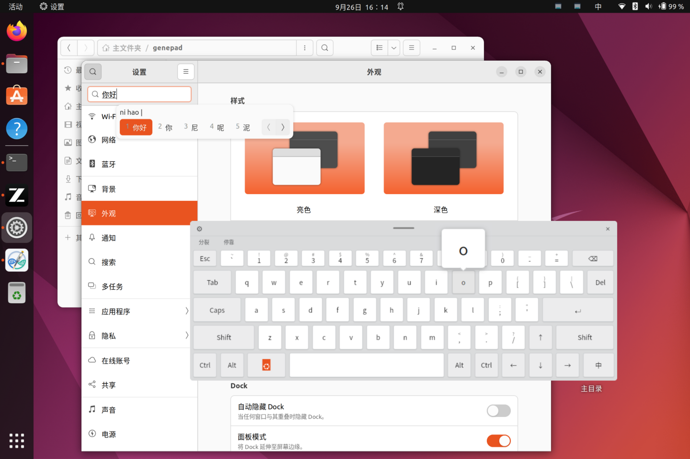
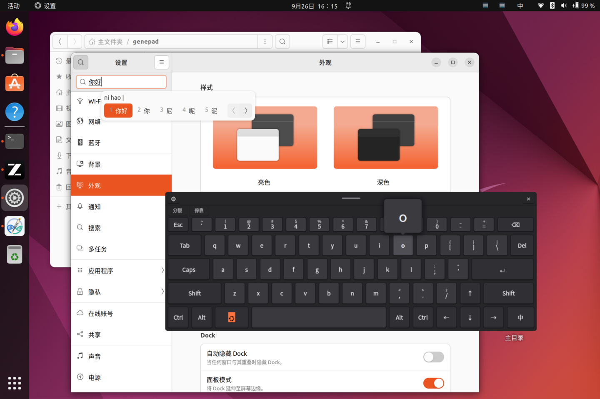

# TouchKeyboard — Linux 触屏键盘

基于 **Tauri 2 + Rust** 的 Linux 触摸屏虚拟键盘。支持 X11 与 Wayland,完整/分裂双布局,
自动适配屏幕尺寸,可调透明度与大小,可最小化为可拖动悬浮球,托盘常驻后台,
内置屏幕触摸板与按键气泡,支持日/夜主题与应用内新版本检测。


 

| 浅色主题 | 深色主题 |
|---|---|
|  |  |

> 真机 GNOME Wayland (Ubuntu 22.04) 实拍:停靠模式下向 GNOME「设置」搜索框打字(IBus 拼音),
> 键盘不抢焦点、候选词正常上屏;`o` 键上方是按键气泡,dock 自动避让。「开始」键直接取系统图标。

目标环境为 GNOME Wayland(Ubuntu 22.04)+ XWayland,兼容纯 X11 会话。

## 下载安装

**一键安装**(自动获取最新 Release:Debian/Ubuntu 安装 `.deb`,无法提权或其他发行版安装
AppImage 到用户目录并创建应用菜单项;再次运行即可升级到最新版):

```bash
curl -fsSL https://raw.githubusercontent.com/Masterchiefm/touch-keyboard/main/scripts/install.sh | bash
```

- 安装指定版本:

  ```bash
  curl -fsSL https://raw.githubusercontent.com/Masterchiefm/touch-keyboard/main/scripts/install.sh | TOUCH_KB_VERSION=v0.1.0 bash
  ```

- GitHub 访问不畅(国内)时走加速代理,`<加速前缀>` 为任一 GitHub 加速服务(形如 `https://xxx/`),脚本查版本、下载安装包均走该代理:

  ```bash
  GH_PROXY=<加速前缀> bash -c "$(curl -fsSL <加速前缀>/https://raw.githubusercontent.com/Masterchiefm/touch-keyboard/main/scripts/install.sh)"
  ```

- Debian/Ubuntu 安装 `.deb` 时会请求 sudo 密码(自动补齐依赖;提权失败会自动转用 AppImage);
  Wayland 会话下脚本会顺带配置 uinput 权限并提示注销重登(无 sudo 权限时只提示手动命令),
  X11 会话跳过该步。

也可以从 [GitHub Releases](https://github.com/Masterchiefm/touch-keyboard/releases) 手动下载:

| 产物 | 适用 | 安装 |
|---|---|---|
| `TouchKeyboard_x.y.z_amd64.deb` | Debian / Ubuntu 及衍生 | `sudo apt install ./TouchKeyboard_x.y.z_amd64.deb` |
| `TouchKeyboard_x.y.z_amd64.AppImage` | 其他发行版 | `chmod +x TouchKeyboard_*.AppImage && ./TouchKeyboard_*.AppImage`(需要 FUSE) |

安装后按[下文](#uinput-权限配置推荐wayland-会话必需)配置 uinput 权限(Wayland 会话按键注入必需;
一键安装脚本在 Wayland 会话下已自动配置)。

## 功能

| 功能 | 说明 |
|---|---|
| 完整 / 分裂键盘 | 点 `⇄` 或托盘菜单切换;完整布局参照实体键盘固定为标准五排:Esc、`` ~ `` 与数字行(每键带上档符号)、Tab、CapsLock、双 Shift、`[{ ]} \|`、方向键,退格固定右上角;分裂布局键盘分居屏幕左右两侧,中间留空,方便双手握持平板时用拇指输入 |
| 屏幕自适应 | 启动时读取显示器分辨率与缩放,自动计算键盘宽度与高度,贴底显示 |
| 拖动移动 / 悬浮模式 | 按住键盘顶栏的拖动把手即可用手指/鼠标移动位置,松手自动切换为悬浮模式(可调宽度,位置记忆);点「停靠」按钮随时回到贴底整行 |
| 透明度 / 大小调节 | 设置面板 30%–100% 透明度、70%–150% 大小滑块,实时生效 |
| 悬浮球 | 点 `✕` 键盘缩为屏幕边缘悬浮球;按住可拖动,松手自动吸附最近左右边缘;点一下恢复键盘 |
| 屏幕触摸板 | 类 Windows 系统触摸板:单指移动/轻触单击、长按滑动拖动、双指滚动/轻触右键、三指轻触中键,速度可调,托盘菜单开关,独立窗口 |
| 按键气泡 | 按下时在键上方放大显示所按字符(手指遮挡键帽时看清输入),可在设置关闭 |
| 日 / 夜主题 | 浅色 / 深色 / 跟随系统(GNOME 深浅色自动切换),参照 Windows 屏幕键盘配色 |
| 输入法指示 | 键盘上实时显示当前输入法短标签(中 / En / あ / 한 …) |
| 常驻后台 | 关闭键盘只是最小化到悬浮球;托盘图标常驻:左键显示/隐藏,右键菜单 |
| 空白穿透 | 鼠标/触摸落在按键之外的空白处(如分裂布局中缝)时,点击穿透键盘直达下层应用 |
| dock 避让 | 自动读取 WM 工作区(`_NET_WORKAREA`),键盘与悬浮球不会伸进 dock/面板区域 |
| 输入不抢焦点 | 键盘窗口不接受焦点,点按键时目标应用保持焦点,输入直达目标应用 |
| 新版本检测 | 启动 8 秒后与每日自动检查 GitHub Release;发现新版本时键盘 ⚙ 出现红点、设置窗口显示更新卡片,点「查看更新」打开下载页 |

按键能力:标准 QWERTY 布局(上档符号经 Shift/Caps 触发,如 `1`+Shift=`!`)、
长按退格与方向键连发、一次性 Shift(双击锁定大写)、一次性 Ctrl/Alt 组合键(如 Ctrl 再点 C = 复制)、
「开始」键(Super,调出 GNOME 活动概览,键帽自动取系统图标)、「中」键(Super+Space 切换输入法)。
按键按下即触发(无需抬起),快速连打不丢键。

## 从源码运行

```bash
# 前端为 ui/ 纯静态 HTML/JS, 无 Node 构建步骤
cd src-tauri && cargo run          # 开发运行
cargo build --release              # 正式构建
./target/release/touch-keyboard
```

系统依赖:GTK3、webkit2gtk-4.1、librsvg、AppIndicator 托盘(GNOME 需 [AppIndicator 扩展](https://extensions.gnome.org/extension/615/appindicator-support/),KDE 原生支持)。
打包 `.deb`/`.AppImage`:`cargo install tauri-cli --version "^2" && cargo tauri build`。

可选环境变量:

- `TOUCH_KB_BACKEND=x11|uinput` 强制指定按键注入后端(默认自动:Wayland 会话优先 uinput,X11 会话优先 XTEST)。
- `TOUCH_KB_WORKAREA=x,y,w,h` 手动指定工作区(物理像素)。dock 避让默认读取 WM 维护的
  `_NET_WORKAREA`;若你的 dock 不预留空间导致遮挡键盘,可用此变量手动留出区域。
- `TOUCH_KB_DEBUG=1` 触摸板注入与手势的调试日志(stderr)。

## Wayland / X11 支持说明

- **窗口部分**:程序检测到 XWayland 时强制走 X11(GTK 后端),以此获得窗口定位、置顶、
  点击穿透、不抢焦点能力(Wayland 原生窗口没有这些 API)。GNOME/KDE 等 Wayland 会话
  默认都有 XWayland,开箱即用。
- **按键注入部分**(双后端,自动选择):
  - `x11-xtest`:X11/XWayland 会话,无需特殊权限,但按键只到达 X11 应用;
  - `uinput`:内核级虚拟键盘(设备名 `TouchKeyboard`),**Wayland 与 X11 都可用**,
    按键可到达包括原生 Wayland 应用在内的所有窗口。需要 `/dev/uinput` 写权限。

### uinput 权限配置(推荐,Wayland 会话必需)

```bash
sudo bash scripts/setup-uinput.sh
# 然后注销重新登录一次(或重启)使 input 组生效
```

脚本内容:安装 udev 规则(`KERNEL=="uinput", MODE="0660", GROUP="input"`)并把当前用户加入 `input` 组。
未配置权限时,X11 会话仍可用(XTEST 自动兜底);Wayland 会话会提示输入后端不可用。

## 项目结构

```
touch-keyboard/
├── ui/                       # 前端(纯静态,无构建步骤)
│   ├── index.html/main.js    # 键盘:布局渲染、按键处理、穿透区域上报、⚙ 更新角标
│   ├── ball.html/ball.js     # 悬浮球:拖动、边缘吸附、点击恢复
│   ├── settings.html/js      # 独立设置窗口:全部设置 + 主题 + 版本/更新检查
│   ├── touchpad.html/js      # 屏幕触摸板窗口
│   └── style.css             # 触摸友好样式, html.dark 深色主题
├── src-tauri/
│   ├── src/main.rs           # 窗口几何/托盘/命令/拖动线程/XShape/主题与输入法轮询/更新检查编排
│   ├── src/updater.rs        # 新版本检测:GitHub Release 查询 + 版本比较(纯函数,含单测)
│   ├── src/input/x11.rs      # XTEST 按键注入(支持 Shift/AltGr, 任意布局)
│   ├── src/input/uinput.rs   # uinput 虚拟键盘/鼠标/画笔(内核级)
│   ├── src/input/mouse.rs    # 触摸板鼠标注入抽象(XTEST/uinput)
│   └── src/xutil.rs          # X11 不抢焦点/Shape 输入区域/工作区/全局光标
├── .github/workflows/build.yml  # CI: v* 标签自动构建并发布 Release
├── scripts/
│   ├── install.sh            # 一键安装: 查最新 Release → 按发行版装 .deb 或 AppImage + uinput 权限
│   ├── release.sh            # 发版脚本(版本号同步 + 提交 + 打标签)
│   ├── setup-uinput.sh       # uinput 权限配置
│   └── smoke-test.sh         # Xvfb 冒烟测试
└── tools/gen_icons.py        # 图标生成(纯标准库 Python)
```

## 实现要点

- **点击穿透**:使用 X11 SHAPE 扩展把窗口输入区域设为按键区域并集(服务端静态生效)。
  按键上即时可点(触摸/鼠标无延迟),空白处穿透直达下层应用,无轮询竞争——
  真实触摸"瞬移落下"也不会像轮询方案那样穿透丢焦点。
- **不抢焦点**:通过 GTK `set_accept_focus(false)`(并在每次绘制后重新断言),
  点按键时目标应用保持焦点,XTEST/uinput 注入的键直接进入目标应用。
- **悬浮球拖动**:JS 只上报按下/抬起,拖动跟随由 Rust 线程轮询 X 全局光标坐标完成
  (`窗口位置 = 起始位置 + 光标位移`),与窗口自身移动解耦,不闪不抖,触摸同样可用。
- **真实触摸**:WebKitGTK 对触摸输入只派发 touch 事件(不一定派发 pointer 事件),
  因此按键同时监听 `pointerdown` 与 `touchstart` 并以 100ms 窗口去重。
- **屏幕触摸板指针**:mutter 的触摸模拟会把合成器光标"胶"在手指位置,且不转发
  XTEST 移动、忽略 uinput 虚拟画笔——唯一可用的是 uinput 相对移动。对策是
  "虚拟指针 V + 阻尼伺服":全板扫过 ≈ 一屏,抬手后自动把光标从鬼影拉回 V。
- **新版本检测**:后台线程启动 8s 后查一次 GitHub `releases/latest`,之后每天一次;
  版本比较用三段式解析(解析失败的 tag 宁可漏报不误报);自动路径失败完全静默,
  只有手动点「检查更新」才提示原因。Linux 无安全的自动安装路径(deb 需 root),
  故检测到新版本后引导用户到 Release 页面手动下载。

## 版本管理与发布

- 版本号唯一定义在 `src-tauri/tauri.conf.json` 与 `src-tauri/Cargo.toml`(两处一致,
  应用内更新检测读取前者)。
- 发布:`scripts/release.sh x.y.z` 同步版本号 → 提交 → 打 `vx.y.z` 标签 → 推送;
  CI([build.yml](.github/workflows/build.yml))自动构建 `.deb`/`.AppImage` 并发布
  GitHub Release,应用内新版本检测随即可见。
- 手动触发:Actions 页 Run workflow 只出 Artifacts,不发 Release。

## 已知限制

- uinput 按物理位置发码,假定美式 QWERTY 布局(XTEST 后端无此限制,支持任意布局);
- GNOME 原生 Wayland(无 XWayland 的极端环境)下窗口定位/穿透受限;
- 托盘图标在 GNOME 下需要 AppIndicator 扩展支持(KDE 原生支持);
- AppImage 运行需要 FUSE(`sudo apt install libfuse2`),或用 `--appimage-extract-and-run`。

## 许可

[MIT](LICENSE) © 2026 Masterchiefm
